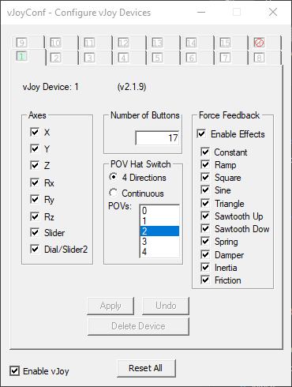

# OcuJoy

Map Oculus Touch motion/rotation to a vJoy virtual joystick, primarily for Elite: Dangerous in VR.

If you've played VTOL VR or No Man's Sky VR, the controls should be somewhat familiar.

Can also be configured to work with several other applications that have controller support; for example, it works to some extent with Everspace.

Fingers crossed for native VR controller support in Star Wars: Squadrons, but failing that, OcuJoy should work.

## Usage

1. Install [vJoy](http://vjoystick.sourceforge.net/site/index.php/download-a-install/download).
   - Set up the virtual joystick as such:

     
   - If you plan to use the `--hatbuttons` and/or `--triggerbuttons` options,
     you'll need to enable at least 17 buttons on the joystick.
2. Grab a release from the releases section, unzip it, and run it. A debug window will pop up.
3. Included in the release will be a .binds file, which is my personal input bindings for Elite Dangerous.

   You may have to tweak some values that use vJoy to get the right axis and inversions:
   
   - Flight Thrust X, Y, Z
   - Drive Thrust X
   - Galaxy Map X, Y, Z\*
   - FSS Scanner

\* This also configures the system map; however it uses the wrong axis for vertical movement. Can't do much about this.

You don't need to have anything (e.g. SteamVR) running before you run it, and you can
close/reopen OcuJoy whenever you want. It won't block other Oculus applications.

### Left Stick

The left stick is mapped to vJoy's X, Y and Z axes.

- Grab a point in space using the grip button, then drag away in any direction
  to increase a particular axis.
- Currently this is mapped on a slight exponential curve - I've found that this
  helps with flight precision.
- I use this for Flight Thrust, as in my control scheme I have increase/decrease
  throttle bound to `Left Touch Joystick Y`. This allows you to thrust in any
  direction using the controller, and use the throttle joystick when you don't want
  to keep gripping the controller.

### Right Stick

The right stick is mapped to vJoy's rX, rY and rZ axes.

- Grab a point in space using the grip button, then rotate the stick on any set
  of axes.
- I use this for pitch/roll/yaw. The rotation limits are set to match the in-game
  joystick rotation limits as closely as possible, so you should see the in-game
  joystick match your hand position.
- The rotation is mapped based on your _starting hand rotation_ - it doesn't matter
  which way your hand is pointing when you grip.

### Buttons & Hats

You can enable button, hat and trigger capturing by passing the `--input` flag to ocujoy.exe.

If you are working with a game that doesn't accept the vJoy POV hats or triggers, you can pass two other options:

- `--hatbuttons` maps the two Oculus joystick hats to four vJoy buttons each, instead of the vJoy POV hats.
- `--triggerbuttons` maps the two Oculus triggers to vJoy buttons. The buttons are triggered when you push the trigger in by 50%.

Possibly coming soon, depending on interest and my time:

- Configure thresholds, values and mappings
- Configurable input styles for each hand
